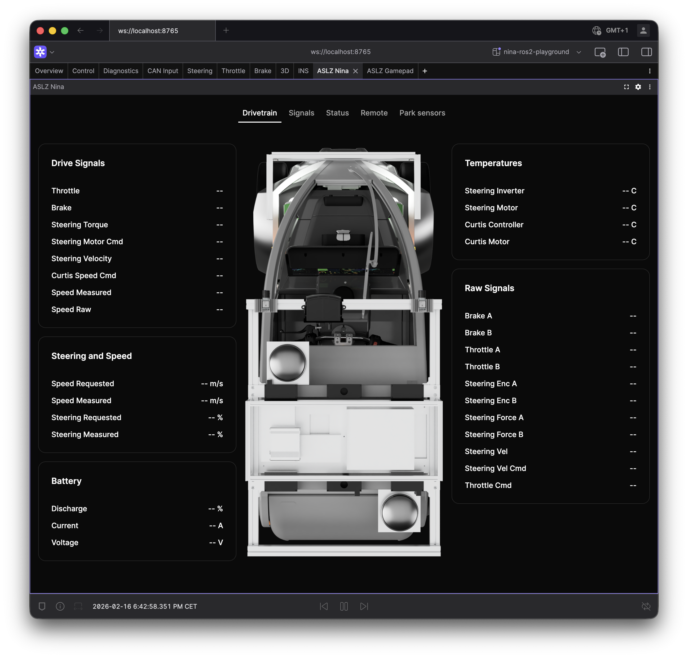

# Nina005 Extension

A [Foxglove Studio](https://github.com/foxglove/studio) panel extension for visualizing Nina005 vehicle telemetry. It presents vehicle state, raw drivetrain signals, remote control requests, and ultrasonic parking sensors through dedicated tabs.



---

## Views

The panel exposes one active tab at a time. Each tab focuses on a specific data domain so operators can switch quickly between high-level status and low-level diagnostics.

| View | Description | Typical use |
|------|-------------|-------------|
| **Cluster** | Consolidated vehicle overview | Driver-facing monitoring |
| **Dashboard** | Aggregated telemetry cards | General health checks |
| **Drivetrain** | Battery, steering/speed, temperatures, raw drivetrain signals | Powertrain analysis |
| **Signals** | Raw control signal diagnostics | Signal-level debugging |
| **Status** | Application + general vehicle status | Runtime status verification |
| **Remote** | Remote drive/indicator/app-toggle requests | Remote command monitoring |
| **Park Sensors** | Front/rear ultrasonic sensor visualization | Proximity awareness |

---

## Features

### Data
- Supports structured schemas from `src/schemas` (status, battery, drivetrain, remote, ultrasonic).
- Separates high-level and raw diagnostics into dedicated views.
- Handles optional message availability gracefully per tab.

### UI
- Tabbed interface with optional top menu bar.
- Optional park-sensor display and controls toggles.

---

## Installation

### Release `.foxe` file

Use the packaged `.foxe` artifacts in the repository root, or build your own package and drag-and-drop it into Foxglove Studio.

### Build from source

```bash
pnpm install
pnpm run package         # produces a .foxe file
pnpm run local-install   # build + install into local Foxglove desktop
```

### Dev harness (no Foxglove required)

Iterate on the panel UI in a browser:

```bash
pnpm install
pnpm run dev             # starts Vite at http://localhost:5173
```

The harness entrypoint is `dev/main.tsx` and uses mocked data from `dev/mock-vehicle.ts`.

---

## Development

### Commands

```bash
pnpm run dev
pnpm run build
pnpm run lint
pnpm run lint:fix
pnpm run local-install
pnpm run package
```

### Tailwind CSS tasks

Use VS Code tasks:

- `Build Tailwind CSS`
- `Watch Tailwind CSS`

---

## Architecture

W.I.P

---

## Project Structure

```text
src/
	app.tsx           # React app
    index.tsx         # Foxglove entry point
	panel.tsx         # Foxglove panel
	components/
		park-sensor/
		settings/
		ui/           # Shared UI primitives (shadcn/ui)
	schemas/
	styles/
	views/
dev/                  # Vite dev harness (no Foxglove required)
	harness.tsx
	main.tsx
	mock-vehicle.ts
docs/                 # Platform-specific guides
```

---

## References

- [Foxglove Extension Documentation](https://docs.foxglove.dev/docs/visualization/extensions/introduction)
- [Packaging and Publishing](https://docs.foxglove.dev/docs/visualization/extensions/publish/#packaging-your-extension)
- [Changelog](CHANGELOG.md)

---

## License

UNLICENSED
