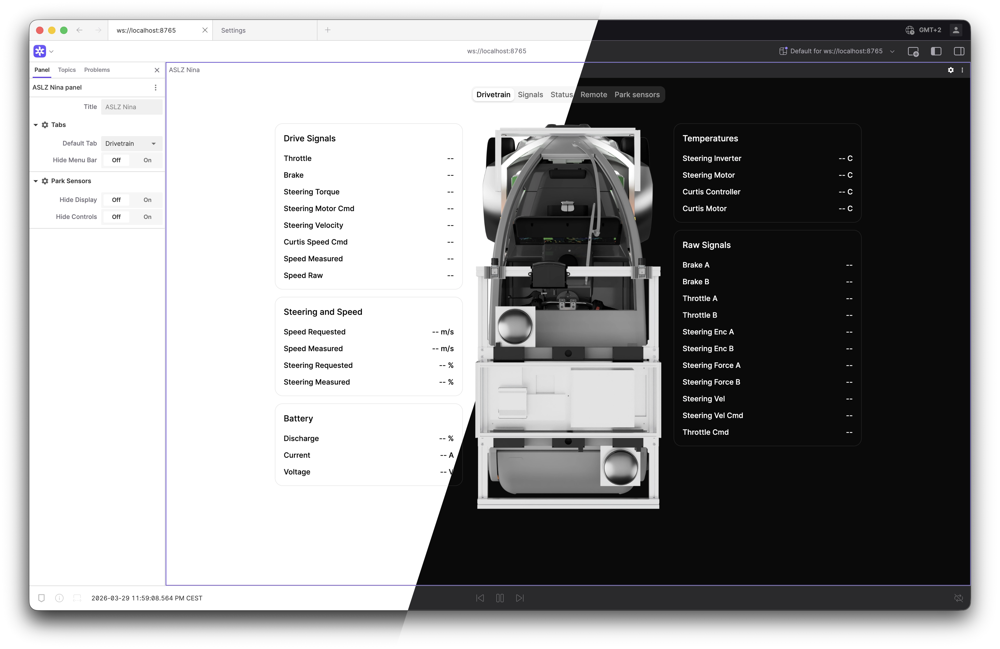
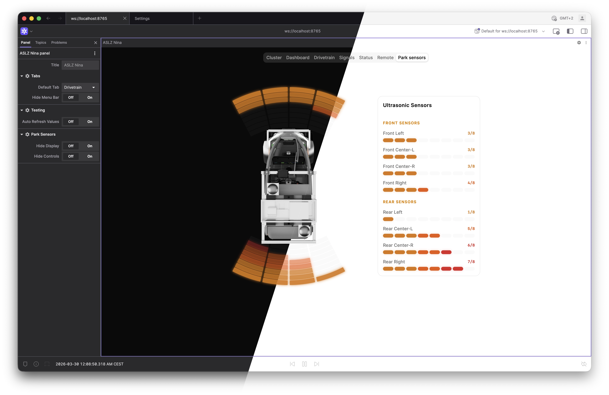

# ASLZ Nina005 Extension


[](https://vscode.dev/redirect?url=vscode://ms-vscode-remote.remote-containers/cloneInVolume?url=https://github.com/XENONFFM/nina005-foxglove-extension)

A [Foxglove](https://foxglove.dev/) panel extension for visualizing Nina005 vehicle telemetry. It presents vehicle state, raw drivetrain signals, remote control requests, and ultrasonic parking sensors through dedicated tabs.

|  |  |
| :-------------------------------------------------: | :-------------------------------------------------: |

## Features

### Data

- Supports structured schemas from `src/schemas` (status, battery, drivetrain, remote, ultrasonic).
- Separates high-level and raw diagnostics into dedicated views.

### Views

The panel exposes one active tab at a time. Each tab focuses on a specific data domain so operators can switch quickly between high-level status and low-level diagnostics.

| View             | Description                                  |
| ---------------- | -------------------------------------------- |
| **Cluster**      | Driver Information Display                   |
| **Dashboard**    | Aggregated telemetry                         |
| **Drivetrain**   | Propulsion, steering, battery and other data |
| **Signals**      | Raw control signal diagnostics               |
| **Status**       | Application + general vehicle status         |
| **Remote**       | Remote drive/indicator/app-toggle requests   |
| **Park Sensors** | Front/rear ultrasonic sensor visualization   |

### Settings

All panel options are exposed in the Foxglove settings tree so they persist across sessions and can be managed from the Foxglove settings sidebar.

## Installation

### Release `.foxe` file

Download the latest `.foxe` from the [Releases](https://github.com/XENONFFM/nina005-foxglove-extension/releases) page and drag-and-drop it onto Foxglove Studio (desktop or web).

### Build from source

```bash
pnpm install
pnpm run package   # produces a .foxe file
pnpm run local-install  # build + install into local Foxglove desktop
```

### Development in Dev Container

This repository supports VS Code Dev Containers for a consistent local environment.

- Open the repo in VS Code and choose **Reopen in Container**.
- The container includes the required toolchain for development (Node.js, pnpm, TypeScript, ESLint, and Git).
- Run the same commands shown in this README inside the container terminal.

### Dev harness (no Foxglove required)

Iterate on the UI in a browser without launching Foxglove:

```bash
pnpm install
pnpm run dev       # starts Vite at http://localhost:5173
```

The harness renders the panel with a mocked Foxglove context, allowing you to test UI changes and settings in real-time.

**[→ Full Dev Harness Documentation](docs/DEV_HARNESS.md)**

## Architecture

W.I.P

## Project Structure

```text
dev/                  # Vite dev harness (no Foxglove required)
	harness.tsx
	main.tsx
	mock-vehicle.ts
src/
	app.tsx           # React app
    index.tsx         # Foxglove entry point
	panel.tsx         # Foxglove panel
	components/		  # Shared UI components
	schemas/
	styles/
	views/
```
